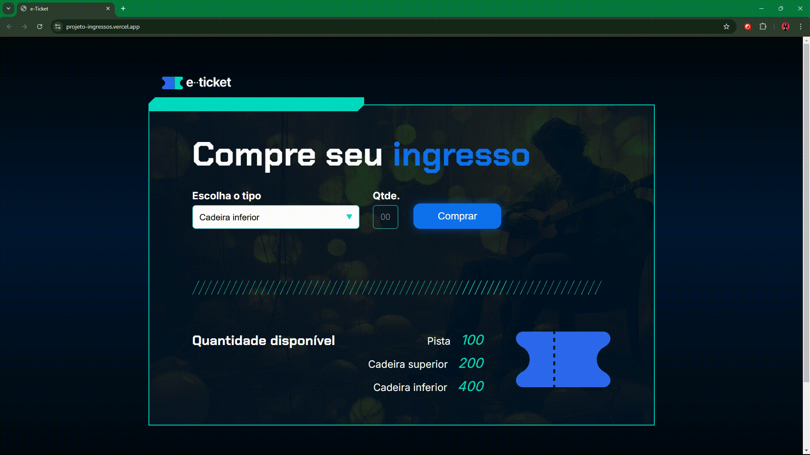

# 🎫 E-Ticket

## 📰 Descrição

Quarto projeto do último curso de Lógica de Programação da Alura

Esse projeto simula um site de compra de ingressos, onde cada "setor" possui uma quantidade limitada de ingressos disponíveis, que podem ser esgotados ao clicar no botão "Comprar"

> Assim como os últimos, esse projeto continua utilizando de conceitos aprendidos anteriormente (adicionar ou remover atributos CSS pelo JS, funções, estruturas de condição...)
> - Adicionalmente, há **alterações no CSS (opcionais e feitas individualmente):** alteração do próprio CSS pelo JS **(número de ingressos disponíveis fica em vermelho ao ser "esgotado")** e criação de uma classe que **deixa o botão Comprar "inválido" (e é acionada quando todos ingressos forem "esgotados")**

## 🔗 Link para vizualização

## 💻 Tecnologias Utilizadas
`Trabalhado durante o curso:`

 

`Modificado para novas implementações OPCIONAIS:`

`Desenvolvido anteriormente pela Alura:`

 

## 🏅 Certificado de Conclusão 

## 🙋 Autores
[    Gabriel Possato ](https://github.com/possatogabriel)
 
 

    

